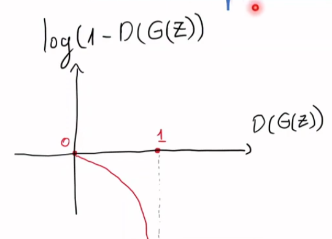
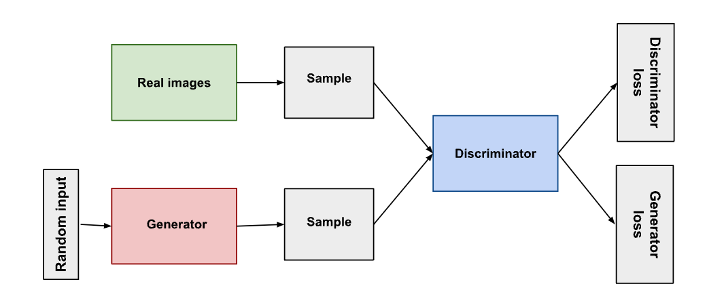
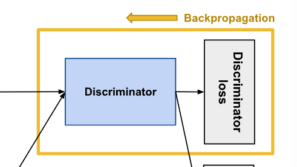
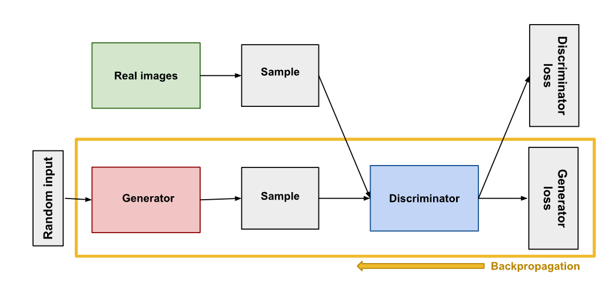
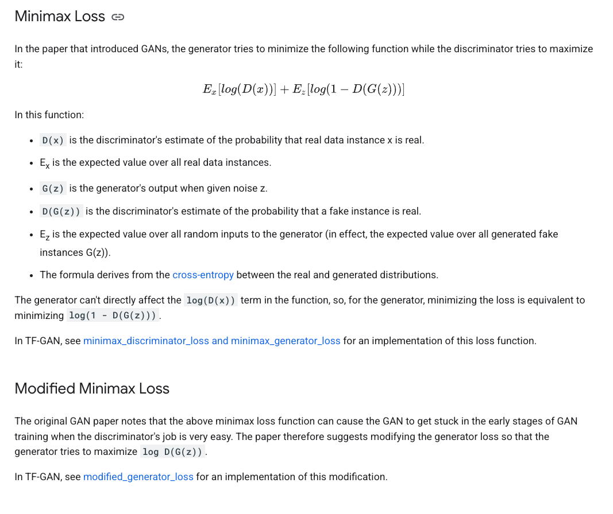
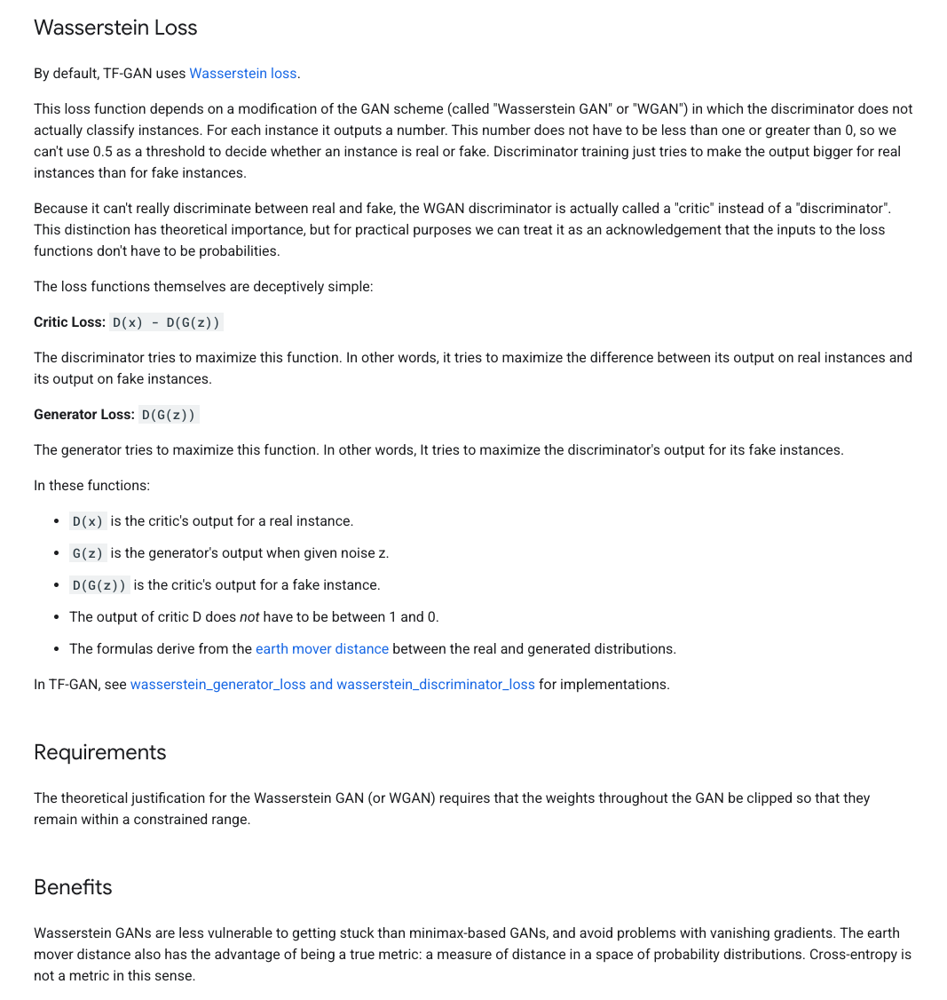

# Week 3: Deep Dive in GANs and more

[](https://www.notion.so/18525c5aa3928009b08aed2c9e231d54?pvs=21)

# **Generative Adversarial Networks (GANs)**

## [**What are GANs](https://youtu.be/xBX2VlDgd4I?si=UI1y108eduAKSQXa)?**

- GANs are a type of neural network architecture consisting of two networks:
    1. **Generator**: Creates synthetic data that mimics real data.
    2. **Discriminator**: Distinguishes between real and synthetic data.
- The generator and discriminator are trained adversarially, improving each other's performance iteratively.

[https://youtu.be/xBX2VlDgd4I?si=UI1y108eduAKSQXa](https://youtu.be/xBX2VlDgd4I?si=UI1y108eduAKSQXa)

## Architecture

- **Generator**:
    - Takes a random noise vector (z) as input.
    - Outputs synthetic data (e.g., images, text, time series).
- **Discriminator**:
    - Takes real or synthetic data as input.
    - Outputs a probability indicating whether the data is real or fake.

- **Adversarial Training**:
    - **Generator Loss**: Tries to fool the discriminator.
    - **Discriminator Loss**: Tries to distinguish real data from generated data.
    
    ### **Loss Function for GANs**
    
    In a standard GAN:
    
    - The **Discriminator (D)** and **Generator (G)** are trained with opposing goals.
    
    The objective function is:
    
    $\min_G \max_D V(D, G) = \mathbb{E}_{x \sim P_{\text{data}}}[\log D(x)] + \mathbb{E}_{z \sim P_z}[\log (1 - D(G(z)))]$
    
    1. **Discriminator's Objective**:
        - Maximize the probability of correctly classifying real data (*x*) as real and generated data (G(z)) as fake:
            
            $\max_D \mathbb{E}_{x \sim P_{\text{data}}}[\log D(x)] + \mathbb{E}_{z \sim P_z}[\log (1 - D(G(z)))]$
            
    2. **Generator's Objective**:
        - Minimize the probability that the discriminator correctly classifies generated data as fake:
        
        $\min_G \mathbb{E}_{z \sim P_z}[\log (1 - D(G(z)))]$
        
    
    [MATHHHHHHH](https://www.notion.so/MATHHHHHHH-18525c5aa39280ce8d6bfcd7fec8960d?pvs=21)
    
    [How does loss function teach?](https://www.notion.so/How-does-loss-function-teach-18525c5aa392806ea328da6f1bac6d6d?pvs=21)
    

[https://youtu.be/-UDvuBpcCXw](https://youtu.be/-UDvuBpcCXw)




## **5 Steps of Training GANs**

1. **Define GAN** architecture based on the application.
2. **Train the discriminator** to distinguish between real and fake data.
3. **Train the generator** to produce data that fools the discriminator.
4. Continue training both networks for **multiple epochs**.
5. **Save the generator model** for generating new, realistic synthetic data.

<aside>
💡

When training Discriminator: 

- Hold Generator values constant

When training Generator: 

- Hold Discriminator values constant

Each should train against static adversary

</aside>

## **Applications**

- **Image Generation**: Create realistic images from noise.
- **Data Augmentation**: Generate synthetic data for underrepresented classes.
- **Super-Resolution**: Improve image resolution.
- **Video Generation**: Create videos from text or keyframes.
- **Art and Creativity**: Generate music, art, or other creative outputs.
- Sample Example
    
    ### Sample python
    
    ```python
    #!/usr/bin/env python
    
    from keras.datasets import mnist
    from keras.layers import Input, Dense, Reshape, Flatten
    from keras.layers import BatchNormalization
    from keras.layers.advanced_activations import LeakyReLU
    from keras.models import Sequential, Model
    from keras.optimizers import Adam
    import matplotlib.pyplot as plt
    import numpy as np
    
    #Define input image dimensions
    #Large images take too much time and resources.
    img_rows = 28
    img_cols = 28
    channels = 1
    img_shape = (img_rows, img_cols, channels)
    
    ##########################################################################
    #Given input of noise (latent) vector, the Generator produces an image.
    def build_generator():
    
        noise_shape = (100,) #1D array of size 100 (latent vector / noise)
    
    #Define your generator network 
    #Here we are only using Dense layers. But network can be complicated based
    #on the application. For example, you can use VGG for super res. GAN.         
    
        model = Sequential()
    
        model.add(Dense(256, input_shape=noise_shape))
        model.add(LeakyReLU(alpha=0.2))
        model.add(BatchNormalization(momentum=0.8))
        model.add(Dense(512))
        model.add(LeakyReLU(alpha=0.2))
        model.add(BatchNormalization(momentum=0.8))
        model.add(Dense(1024))
        model.add(LeakyReLU(alpha=0.2))
        model.add(BatchNormalization(momentum=0.8))
        
        model.add(Dense(np.prod(img_shape), activation='tanh'))
        model.add(Reshape(img_shape))
    
        model.summary()
    
        noise = Input(shape=noise_shape)
        img = model(noise)    #Generated image
    
        return Model(noise, img)
    
    #Alpha — α is a hyperparameter which controls the underlying value to which the
    #function saturates negatives network inputs.
    #Momentum — Speed up the training
    ##########################################################################
    
    #Given an input image, the Discriminator outputs the likelihood of the image being real.
        #Binary classification - true or false (we're calling it validity)
    
    def build_discriminator():
    
        model = Sequential()
    
        model.add(Flatten(input_shape=img_shape))
        model.add(Dense(512))
        model.add(LeakyReLU(alpha=0.2))
        model.add(Dense(256))
        model.add(LeakyReLU(alpha=0.2))
        model.add(Dense(1, activation='sigmoid'))
        model.summary()
    
        img = Input(shape=img_shape)
        validity = model(img)
    
        return Model(img, validity)
    #The validity is the Discriminator’s guess of input being real or not.
    
    #Now that we have constructed our two models it’s time to pit them against each other.
    #We do this by defining a training function, loading the data set, re-scaling our training
    #images and setting the ground truths. 
    def train(epochs, batch_size=128, save_interval=50):
    
        # Load the dataset
        (X_train, _), (_, _) = mnist.load_data()
    
        # Convert to float and Rescale -1 to 1 (Can also do 0 to 1)
        X_train = (X_train.astype(np.float32) - 127.5) / 127.5
    
    #Add channels dimension. As the input to our gen and discr. has a shape 28x28x1.
        X_train = np.expand_dims(X_train, axis=3) 
    
        half_batch = int(batch_size / 2)
    
    #We then loop through a number of epochs to train our Discriminator by first selecting
    #a random batch of images from our true dataset, generating a set of images from our
    #Generator, feeding both set of images into our Discriminator, and finally setting the
    #loss parameters for both the real and fake images, as well as the combined loss. 
        
        for epoch in range(epochs):
    
            # ---------------------
            #  Train Discriminator
            # ---------------------
    
            # Select a random half batch of real images
            idx = np.random.randint(0, X_train.shape[0], half_batch)
            imgs = X_train[idx]
    
     
            noise = np.random.normal(0, 1, (half_batch, 100))
    
            # Generate a half batch of fake images
            gen_imgs = generator.predict(noise)
    
            # Train the discriminator on real and fake images, separately
            #Research showed that separate training is more effective. 
            d_loss_real = discriminator.train_on_batch(imgs, np.ones((half_batch, 1)))
            d_loss_fake = discriminator.train_on_batch(gen_imgs, np.zeros((half_batch, 1)))
        #take average loss from real and fake images. 
        #
            d_loss = 0.5 * np.add(d_loss_real, d_loss_fake) 
    
    #And within the same loop we train our Generator, by setting the input noise and
    #ultimately training the Generator to have the Discriminator label its samples as valid
    #by specifying the gradient loss.
            # ---------------------
            #  Train Generator
            # ---------------------
    #Create noise vectors as input for generator. 
    #Create as many noise vectors as defined by the batch size. 
    #Based on normal distribution. Output will be of size (batch size, 100)
            noise = np.random.normal(0, 1, (batch_size, 100)) 
    
            # The generator wants the discriminator to label the generated samples
            # as valid (ones)
            #This is where the genrator is trying to trick discriminator into believing
            #the generated image is true (hence value of 1 for y)
            valid_y = np.array([1] * batch_size) #Creates an array of all ones of size=batch size
    
            # Generator is part of combined where it got directly linked with the discriminator
            # Train the generator with noise as x and 1 as y. 
            # Again, 1 as the output as it is adversarial and if generator did a great
            #job of folling the discriminator then the output would be 1 (true)
            g_loss = combined.train_on_batch(noise, valid_y)
    
    #Additionally, in order for us to keep track of our training process, we print the
    #progress and save the sample image output depending on the epoch interval specified.  
    # Plot the progress
            
            print ("%d [D loss: %f, acc.: %.2f%%] [G loss: %f]" % (epoch, d_loss[0], 100*d_loss[1], g_loss))
    
            # If at save interval => save generated image samples
            if epoch % save_interval == 0:
                save_imgs(epoch)
    
    #when the specific sample_interval is hit, we call the
    #sample_image function. Which looks as follows.
    
    def save_imgs(epoch):
        r, c = 5, 5
        noise = np.random.normal(0, 1, (r * c, 100))
        gen_imgs = generator.predict(noise)
    
        # Rescale images 0 - 1
        gen_imgs = 0.5 * gen_imgs + 0.5
    
        fig, axs = plt.subplots(r, c)
        cnt = 0
        for i in range(r):
            for j in range(c):
                axs[i,j].imshow(gen_imgs[cnt, :,:,0], cmap='gray')
                axs[i,j].axis('off')
                cnt += 1
        fig.savefig("images/mnist_%d.png" % epoch)
        plt.close()
    #This function saves our images for us to view
    
    ##############################################################################
    
    #Let us also define our optimizer for easy use later on.
    #That way if you change your mind, you can change it easily here
    optimizer = Adam(0.0002, 0.5)  #Learning rate and momentum.
    
    # Build and compile the discriminator first. 
    #Generator will be trained as part of the combined model, later. 
    #pick the loss function and the type of metric to keep track.                 
    #Binary cross entropy as we are doing prediction and it is a better
    #loss function compared to MSE or other. 
    discriminator = build_discriminator()
    discriminator.compile(loss='binary_crossentropy',
        optimizer=optimizer,
        metrics=['accuracy'])
    
    #build and compile our Discriminator, pick the loss function
    
    #SInce we are only generating (faking) images, let us not track any metrics.
    generator = build_generator()
    generator.compile(loss='binary_crossentropy', optimizer=optimizer)
    
    ##This builds the Generator and defines the input noise. 
    #In a GAN the Generator network takes noise z as an input to produce its images.  
    z = Input(shape=(100,))   #Our random input to the generator
    img = generator(z)
    
    #This ensures that when we combine our networks we only train the Generator.
    #While generator training we do not want discriminator weights to be adjusted. 
    #This Doesn't affect the above descriminator training.     
    discriminator.trainable = False  
    
    #This specifies that our Discriminator will take the images generated by our Generator
    #and true dataset and set its output to a parameter called valid, which will indicate
    #whether the input is real or not.  
    valid = discriminator(img)  #Validity check on the generated image
    
    #Here we combined the models and also set our loss function and optimizer. 
    #Again, we are only training the generator here. 
    #The ultimate goal here is for the Generator to fool the Discriminator.  
    # The combined model  (stacked generator and discriminator) takes
    # noise as input => generates images => determines validity
    
    combined = Model(z, valid)
    combined.compile(loss='binary_crossentropy', optimizer=optimizer)
    
    train(epochs=100, batch_size=32, save_interval=10)
    
    #Save model for future use to generate fake images
    #Not tested yet... make sure right model is being saved..
    #Compare with GAN4
    
    generator.save('generator_model.h5')  #Test the model on GAN4_predict...
    #Change epochs back to 30K
                    
    #Epochs dictate the number of backward and forward propagations, the batch_size
    #indicates the number of training samples per backward/forward propagation, and the
    #sample_interval specifies after how many epochs we call our sample_image function.
    ```
    
    ## Discriminator
    
    ```python
    # Import necessary libraries from Keras
    from keras.models import Sequential, Model
    from keras.layers import Dense, LeakyReLU, Flatten, Input
    
    # Define the Discriminator model
    def build_discriminator():
        # Initialize a Sequential model, which allows us to stack layers one after the other
        model = Sequential()
    
        # Add a Flatten layer to convert the input image into a 1D vector
        # img_shape is the shape of the input image (e.g., (28, 28, 1) for grayscale images or (64, 64, 3) for RGB images)
        model.add(Flatten(input_shape=img_shape))
    
        # Add the first Dense (fully connected) layer with 512 neurons
        # This layer will learn 512 features from the flattened input
        model.add(Dense(512))
    
        # Add the LeakyReLU activation function to introduce non-linearity
        # alpha=0.2 means for negative inputs, the function will output 0.2 * input (instead of 0)
        model.add(LeakyReLU(alpha=0.2))
    
        # Add a second Dense layer with 256 neurons
        # This layer further learns 256 features based on the outputs of the first layer
        model.add(Dense(256))
    
        # Add another LeakyReLU activation function with the same alpha=0.2
        # This ensures negative values don't become completely 0
        model.add(LeakyReLU(alpha=0.2))
    
        # Add the output Dense layer with 1 neuron and a sigmoid activation function
        # This outputs a single probability value between 0 and 1
        # A value closer to 1 means the image is classified as "real," and closer to 0 means "fake"
        model.add(Dense(1, activation='sigmoid'))
    
        # Print a summary of the model, showing the layers and the number of parameters in each
        model.summary()
    
        # Define the input to the Discriminator
        # Input specifies the shape of the image that will be fed into the model
        img = Input(shape=img_shape)
    
        # Pass the input image through the model to compute the validity score (real or fake)
        validity = model(img)
    
        # Create a Keras Model with the defined input (img) and output (validity)
        # This combines everything into a complete Discriminator model
        return Model(img, validity)
    
    ```
    
    ## Generator
    
    ```python
    ##########################################################################
    # Given input of noise (latent) vector, the Generator produces an image.
    def build_generator():
        # Define the shape of the latent noise vector (a 1D array of size 100)
        noise_shape = (100,) 
    
        # The Generator network transforms this noise into an image.
        # This version uses simple Dense layers, but other architectures
        # (e.g., convolutional layers, VGG, or ResNet) can be used for specific applications.
        
        model = Sequential()  # Initialize a Sequential model to stack layers.
    
        # **First Dense layer**: transforms the 100-dimensional noise vector to 256 features.
        model.add(Dense(256, input_shape=noise_shape))
        # Add LeakyReLU activation to introduce non-linearity with a small slope (alpha=0.2) for negative inputs.
        model.add(LeakyReLU(alpha=0.2))
        # Add Batch Normalization to normalize the outputs of the previous layer.
        # This stabilizes and accelerates training by ensuring that the output has a consistent distribution.
        model.add(BatchNormalization(momentum=0.8))  # Momentum controls how quickly the normalization adjusts.
        
        
        # **Second Dense layer**: transforms the 256 features into 512 features.
        model.add(Dense(512))
        model.add(LeakyReLU(alpha=0.2))  # Add non-linearity.
        model.add(BatchNormalization(momentum=0.8))  # Normalize outputs to improve training.
    
        # **Third Dense layer**: transforms the 512 features into 1024 features.
        model.add(Dense(1024))
        model.add(LeakyReLU(alpha=0.2))  # Add non-linearity.
        model.add(BatchNormalization(momentum=0.8))  # Normalize outputs.
    
        # Final Dense layer: produces as many outputs as there are pixels in the target image (flattened).
        # `np.prod(img_shape)` computes the total number of pixels (e.g., for 28x28x1, it’s 784).
        # The activation function is `tanh`, which outputs values between -1 and 1.
        # This is suitable when images are normalized to the same range.
        model.add(Dense(np.prod(img_shape), activation='tanh'))
        # Reshape the output into the desired image shape (e.g., 28x28x1 for grayscale or 64x64x3 for RGB images).
        model.add(Reshape(img_shape))  # Converts the 1D output back into an image format.
    
        # Print the summary of the model architecture (layers, shapes, and parameters).
        model.summary()
    
        # Define the input to the Generator: a noise vector with shape `noise_shape`.
        noise = Input(shape=noise_shape)
    
        # Pass the input noise through the Generator model to create a synthetic image.
        img = model(noise)
    
        # Return the Generator as a Keras Model, where:
        # Input: noise vector.
        # Output: generated image.
        return Model(noise, img)
    
    ```
    

## **GAN Example: Generating Realistic Faces**

**Scenario**:

- You want to create **realistic human face images** for training a facial recognition model.
- The GAN generator learns the distribution of human faces by training on a dataset of real face images.

**How It Works**:

1. The **Generator** creates random, realistic face images.
2. The **Discriminator** checks whether the images are real or fake.
3. Over time, the generator improves, producing hyper-realistic faces.

**Outcome**:

- GANs can create realistic, diverse faces that don’t exist in real life.
- **Limitation**: GANs **generate faces randomly, with no control over attributes like gender, age, or facial expressions.**

# CGAN

## What is CGAN?

- **Conditional GANs (CGANs)** are an extension of GANs where both the generator and discriminator are conditioned on additional information (y).
- Condition y could be:
    - **Class Labels**: E.g., generate images of cats or dogs.
    - **Attributes**: E.g., age, gender, or object properties.
    - **Other Modalities**: E.g., text descriptions or paired images

[https://youtu.be/W5NPlZzebO0?list=PLZsOBAyNTZwboR4_xj-n3K6XBTweC4YVD](https://youtu.be/W5NPlZzebO0?list=PLZsOBAyNTZwboR4_xj-n3K6XBTweC4YVD)

## Architecture

- **Generator**:
    - Input: Random noise (z) and condition (y).
    - Output: Synthetic data that aligns with the given condition.
- **Discriminator**:
    - Input: Real/generated data and the same condition (y).
    - Output: Probability indicating whether the data is real or fake under the given condition.
- **Loss Function**:
    - Incorporates the condition into both networks:
        - $min_G \max_D \mathbb{E}_{x,y}[\log D(x, y)] + \mathbb{E}_{z,y}[\log(1 - D(G(z, y), y))]$
        
        ### **Loss Function for CGANs**
        
        In a Conditional GAN (CGAN), the objective function extends the GAN loss by **conditioning** on additional information y, such as class labels or features. The loss becomes:
        
        $\min_G \max_D \mathbb{E}_{x, y \sim P_{\text{data}}}[\log D(x, y)] + \mathbb{E}_{z \sim P_z, y \sim P_y}[\log (1 - D(G(z, y), y))]$
        
        - **Discriminator Objective**:
            
            $\max_D \mathbb{E}_{x, y \sim P_{\text{data}}}[\log D(x, y)] + \mathbb{E}_{z, y}[\log (1 - D(G(z, y), y))]$
            
            The discriminator evaluates whether the data xx matches the condition y and whether G(z,y) (generated data) adheres to y.
            
        - **Generator Objective**:
            
            $\min_G \mathbb{E}_{z, y}[\log (1 - D(G(z, y), y))]$
            
            The generator tries to create data G(z,y) that matches the condition y and fools the discriminator.
            


## **Why CGANs?**

- GANs generate data randomly and lack control over specific attributes.
- CGANs enable controlled and guided data generation, improving interpretability and utility.
- They are essential for applications requiring **specific outputs** based on input conditions.

### **Training Process**

1. Define CGAN architecture: Add condition (y) to both networks.
2. Train the discriminator:
    - Evaluate real/generated data with their conditions.
3. Train the generator:
    - Create fake data matching the condition to fool the discriminator.
4. Iterate training with adversarial loss.
5. Use the generator with specific conditions to produce controlled outputs.

## **Applications**

1. **Image-to-Image Translation**:
    - Transform one type of image to another (e.g., sketches to real images).
    
    
    
2. **Text-to-Image Synthesis**:
    - Generate images from textual descriptions.
    
    
    
3. **Medical Imaging**:
    - Generate specific types of medical images (e.g., labeled tumor images).
4. **Data Augmentation**:
    - Generate labeled data for supervised learning.
5. **Domain Adaptation**:
    - Transfer data between domains while preserving key features.
6. **Targeted Video Generation**:
    - Produce videos conditioned on specific prompts or initial frames.
7. **CycleGAN**
    
    
    
8. SuperResolution
    
    
    

### **CGAN Example: Generating Faces with Specific Attributes**

**Scenario**:

- You want to create faces with specific attributes (e.g., smiling women or men with glasses) for targeted applications.
- A CGAN is trained using labeled data, where y specifies the desired attributes.

**How It Works**:

1. The **Condition (y)** specifies the attributes for the generated face, such as:
    - Gender: Male or Female.
    - Accessories: Glasses or no glasses.
    - Expression: Smiling or neutral.
2. The **Generator** creates faces based on both noise (z) and the given condition (y).
3. The **Discriminator** checks whether the generated face matches the specified condition (y) in addition to being realistic.

**Outcome**:

- CGANs **generate specific outputs, such as a smiling woman wearing glasses.**
- This is useful in applications requiring labeled synthetic data or controlled outputs.

# **Comparison: GAN vs. CGAN**

### **Why CGANs Make a Difference**

| **Aspect** | **GAN** | **CGAN** |
| --- | --- | --- |
| **Control** | Random output without control | Controlled generation based on y |
| **Use Case** | General data generation | Targeted data synthesis |
| **Example Output** | Any human face | A smiling woman with glasses |
| **Applications** | Creative art, general image synthesis | Conditional data augmentation, domain adaptation |

| **Aspect** | **GAN** | **CGAN** |
| --- | --- | --- |
| **Input to Generator** | Random noise vector (z) | Random noise vector (z) + Condition (y) |
| **Input to Discriminator** | Real/generated data | Real/generated data + Condition (y) |
| **Output Control** | Uncontrolled/random data generation | Controlled generation based on conditions |
| **Loss Function** | Based on adversarial loss | Condition included in loss calculation |
| **Use Cases** | General data synthesis | Applications requiring controlled output (e.g., image-to-image translation) |

### **High-Level Summary**

- **GANs**:
    - **GANs** are powerful for general-purpose generation but lack control over specific outputs.
    - A framework for generating synthetic data with **no specific control over the outputs**.
    - Best suited for tasks requiring general data generation, such as creating high-resolution images or new artistic content.
- **CGANs**:
    - **CGANs** introduce conditional control, making them **ideal for targeted applications where specific attributes or outputs are needed**, such as image translation or labeled data augmentation.
    - An **enhanced GAN** variant that conditions the data generation process on additional input.
    - Ideal for tasks **needing precise control** over generated data, such as targeted image synthesis or medical applications.

---

# Timeseries and CGAN

### **Why Use CGANs for Time-Series?**

1. **Controlled Generation**:
    - Enables the generation of time-series data aligned with **specific conditions**, such as timestamps, weather features, or financial indicators.
    - Example: Generating stock prices **conditioned on market volatility**.
2. **Data Augmentation**:
    - **Augments time-series datasets**, especially when data is scarce or imbalanced.
    - Example: Generating synthetic ECG signals for rare cardiac conditions.
3. **Scenario Simulation**:
    - Creates **hypothetical time-series scenarios** for testing or planning.
    - Example: Simulating power grid load under extreme weather conditions.
4. **Filling Data Gaps**:
    - **Reconstructs missing segments** in incomplete time-series datasets.
    - Example: Filling missing values in IoT sensor data.
5. **Improved Predictive Models**:
    - Augmented data generated by CGANs can **improve the performance** of predictive models trained on time-series data.
    - Example: Enhancing demand forecasting models in retail.

### **Key Use Cases of CGANs for Time-Series**

### **1. Financial Applications**

- **Examples**:
    - Stock price simulation.
    - Cryptocurrency trend forecasting.
    - Portfolio risk analysis.
- **Conditions**:
    - Market indicators (e.g., volatility, trading volume).
    - Historical stock prices.
- **Applications**:
    - Stress testing in financial systems.
    - Simulating rare financial events for risk management.

### **3. Healthcare and Medical Data**

- **Examples**:
    - Electrocardiogram (ECG) signal generation.
    - Electroencephalogram (EEG) signal augmentation.
- **Conditions**:
    - Patient demographics (e.g., age, gender).
    - Disease-specific markers (e.g., arrhythmia patterns).
- **Applications**:
    - Training anomaly detection models.
    - Generating synthetic health signals for underrepresented conditions.

### **5. Weather and Climate Modeling**

- **Examples**:
    - Rainfall patterns over time.
    - Temperature trends by region.
- **Conditions**:
    - Geographical location.
    - Seasonal indicators.
- **Applications**:
    - Simulating extreme weather scenarios.
    - Filling gaps in climate datasets.

### **7. Retail and Sales Forecasting**

- **Examples**:
    - Daily or weekly sales data.
    - Website traffic trends.
- **Conditions**:
    - Promotional events (e.g., holidays, discounts).
    - Demographics (e.g., age, income).
- **Applications**:
    - Generating synthetic sales data for demand forecasting.
    - Simulating customer purchase behaviors.

### **2. Energy Demand Forecasting**

- **Examples**:
    - Electricity usage patterns.
    - Renewable energy generation (e.g., solar, wind).
- **Conditions**:
    - Weather data (e.g., temperature, cloud cover).
    - Time of day or season.
- **Applications**:
    - Generating synthetic data for smart grid optimization.
    - Forecasting peak energy demands under specific conditions.

### **4. Traffic Flow Modeling**

- **Examples**:
    - Vehicle counts on highways.
    - Pedestrian traffic patterns.
- **Conditions**:
    - Time of day (e.g., rush hour, off-peak hours).
    - Location (e.g., urban vs. suburban).
- **Applications**:
    - Urban planning and traffic optimization.
    - Generating data for autonomous vehicle algorithms.

### **6. IoT and Sensor Data**

- **Examples**:
    - Industrial machinery sensor readings.
    - Smart home data (e.g., temperature, motion sensors).
- **Conditions**:
    - Device state (e.g., normal vs. faulty).
    - Environmental factors (e.g., humidity, pressure).
- **Applications**:
    - Predictive maintenance.
    - Simulating sensor data for IoT system testing.

### **How CGANs Work for Time-Series**

1. **Input to Generator**:
    - Random noise (z) + Condition (y) representing time-dependent features (e.g., timestamp, weather condition).
2. **Input to Discriminator**:
    - Real or generated ***time-series data*** paired with the same condition (y).
3. **Output**:
    - The generator *creates synthetic time-series dat*a that aligns with the specified condition.
    - The discriminator evaluates whether the generated data is realistic and consistent with the condition.

### **Advantages of Using CGANs for Time-Series**

1. **Interpretability**:
    - Conditions provide clear control over the generated data, making the outputs more interpretable.
2. **Flexibility**:
    - Can model diverse time-series domains, from finance to healthcare.
3. **Scalability**:
    - Can be extended with RNNs, LSTMs, or Transformers to capture complex temporal dependencies.

### **Challenges in Using CGANs for Time-Series**

1. **Capturing Temporal Dependencies**:
    - Requires specialized architectures (e.g., RNN-based generators) to model long-term dependencies effectively.
2. **Evaluation Metrics**:
    - Measuring the quality of generated time-series data is challenging. Metrics like Dynamic Time Warping (DTW) or domain-specific evaluations are often needed.
3. **Data Preprocessing**:
    - Time-series data often requires normalization, missing value imputation, or other transformations before training.

### **Evaluation Metrics for Time-Series CGANs**

1. **Dynamic Time Warping (DTW)**:
    - Measures similarity between generated and real time-series sequences.
2. **Mean Squared Error (MSE)**:
    - Quantifies the difference between real and generated data points.
3. **Visual Inspection**:
    - Used in applications like ECG generation to verify signal quality.
4. **Domain-Specific Metrics**:
    - Financial data: Compare trends and volatility.
    - Healthcare: Evaluate signal patterns against clinical benchmarks.

### **Summary**

- **Why Use CGANs for Time-Series?**
    - Control over data generation using conditions.
    - Augmenting or simulating time-series datasets for predictive modeling, anomaly detection, and scenario simulation.
- **Applications**:
    - Widely used in finance, healthcare, energy, and traffic modeling.
- **Challenges**:
    - Requires careful preprocessing and evaluation metrics to ensure meaningful outputs.

# Kody

Architecture of GAN’

Main topics:

1. Deep learning ( basic architecture cnn (images ) rnn what kind of problem they good for) time series dl model is good for , risk modelling timeseries hows that link to gan ….
- **CNN (Convolutional Neural Networks)**: Primarily used for image-related tasks, such as classification, object detection, and segmentation. They excel in extracting spatial hierarchies and features like edges, textures, and patterns.
- **RNN (Recurrent Neural Networks)**: Designed for sequential data and time series, such as language modeling, speech recognition, and financial forecasting. They capture temporal dependencies through mechanisms like hidden states.
- **Time Series Models**: Models like LSTMs (a type of RNN) and Transformers are tailored for time series due to their ability to handle long-term dependencies, making them ideal for risk modeling and financial forecasts.
- **GANs in Risk Modeling**: GANs can generate synthetic time series data that resemble real financial data, useful for scenario simulation, stress testing, and portfolio diversification strategies.

Fully connected network and Gan, should gan use that?

What type of data gan is uses?

- GANs for time series typically use:
    - **Financial Data**: Stock prices, volatility, or returns.
    - **Risk Data**: Loss probabilities or Value at Risk (VaR).
    - **Macroeconomic Indicators**: Interest rates, inflation, or GDP trends.
- The GAN is trained on historical data, where the generator produces synthetic time series, and the discriminator evaluates whether the sequences resemble real data.

- Study Conditional GANs (CGANs) and their application to time-series data
- Identify the modifications required for portfolio risk analysis

## Architecture of GANs

https://developers.google.com/machine-learning/gan/gan_structure

A generative adversarial network (GAN) has two parts:

- The **generator** learns to generate plausible data. The generated instances become negative training examples for the discriminator.
- The **discriminator** learns to distinguish the generator's fake data from real data. The discriminator penalizes the generator for producing implausible results.

When training begins, the generator produces obviously fake data, and the discriminator quickly learns to tell that it's fake



Both the generator and discriminator are neural networks. The generator output is connected directly to the discriminator input. Through backpropagation, the discriminator’s classification provides a signal that the generator uses to update its weights. **HOW!!!**

### Discriminator

Simply a classifier. Tries to distinguish real data from the data created by generator. Can use any network architecture appropriate to the type of data it’s classifying.



Discriminator Training data comes from

- real data instances, e.g. real pictures of people, positive examples during training
- fake data instances created by generator, discriminator uses these instances as negative examples during training

→ Weights remain constant while it produces examples for the discriminator to train on

Train Discriminator

- connects to 2 loss functions
- uses the discriminator loss function
1. Discriminator classifies both real data and fake data form the generator
2. the discriminator loss penalizes the discriminator for misclassifying a real instance as fake ora fake instance as real
3. discriminator updates its weights through backpropagation from the discriminator loss through the discriminator network

### The Generator

The generator part of a GAN learns to create fake data by incorporating feedback from the discriminator. It learns to make the discriminator classify its output as real.

Generator training requires tighter integration between the generator and the discriminator than discriminator training requires. The portion of the GAN that trains the generator includes:

- random input
- generator network, which transforms the random input into a data instance
- discriminator network, which classifies the generated data
- discriminator output
- generator loss, which penalizes the generator for failing to fool the discriminator



### Random Input

Neural networks need some form of input. Normally we input data that we want to do something with, like an instance that we want to classify or make a prediction about. But what do we use as input for a network that outputs entirely new data instances?

In its most basic form, a GAN takes random noise as its input. The generator then transforms this noise into a meaningful output. By introducing noise, we can get the GAN to produce a wide variety of data, sampling from different places in the target distribution.

Experiments suggest that the distribution of the noise doesn't matter much, so we can choose something that's easy to sample from, like a uniform distribution. For convenience the space from which the noise is sampled is usually of smaller dimension than the dimensionality of the output space.

## Using the Discriminator to Train the Generator

To train a neural net, we alter the net's weights to reduce the error or loss of its output. In our GAN, however, the generator is not directly connected to the loss that we're trying to affect. The generator feeds into the discriminator net, and the *discriminator* produces the output we're trying to affect. The generator loss penalizes the generator for producing a sample that the discriminator network classifies as fake.

This extra chunk of network must be included in backpropagation. Backpropagation adjusts each weight in the right direction by calculating the weight's impact on the output — how the output would change if you changed the weight. But the impact of a generator weight depends on the impact of the discriminator weights it feeds into. So backpropagation starts at the output and flows back through the discriminator into the generator.

At the same time, we don't want the discriminator to change during generator training. Trying to hit a moving target would make a hard problem even harder for the generator.

So we train the generator with the following procedure:

1. Sample random noise.
2. Produce generator output from sampled random noise.
3. Get discriminator "Real" or "Fake" classification for generator output.
4. Calculate loss from discriminator classification.
5. Backpropagate through both the discriminator and generator to obtain gradients.
6. Use gradients to change only the generator weights.

This is one iteration of generator training. In the next section we'll see how to juggle the training of both the generator and the discriminator.

## Alternating Training

The generator and the discriminator have different training processes. So how do we train the GAN as a whole?

GAN training proceeds in alternating periods:

1. The discriminator trains for one or more epochs.
2. The generator trains for one or more epochs.
3. Repeat steps 1 and 2 to continue to train the generator and discriminator networks.

Similarly, we keep the discriminator constant during the generator training phase. Otherwise the generator would be trying to hit a moving target and might never converge.

## Convergence

As the generator improves with training, the discriminator performance gets worse because the discriminator can't easily tell the difference between real and fake. If the generator succeeds perfectly, then the discriminator has a 50% accuracy. In effect, the discriminator flips a coin to make its prediction.

This progression poses a problem for convergence of the GAN as a whole: the discriminator feedback gets less meaningful over time. If the GAN continues training past the point when the discriminator is giving completely random feedback, then the generator starts to train on junk feedback, and its own quality may collapse.

For a GAN, convergence is often a fleeting, rather than stable, state.

# Loss Functions

GANs try to replicate a probability distribution. They should therefore use loss functions that reflect the distance between the distribution of the data generated by the GAN and the distribution of the real data.

How do you capture the difference between two distributions in GAN loss functions? This question is an area of active research, and many approaches have been proposed. We'll address two common GAN loss functions here, both of which are implemented in TF-GAN:

- **minimax loss**: The loss function used in the [paper that introduced GANs](https://arxiv.org/abs/1406.2661).
- **Wasserstein loss**: The default loss function for TF-GAN Estimators. First described in a [2017 paper](https://arxiv.org/abs/1701.07875).

TF-GAN implements many other loss functions as well.

### 1. **Minimax Loss**

The **minimax loss** was introduced in the original GAN paper (Goodfellow et al., 2014). It is a two-player game where:

- The **discriminator (D)** tries to maximize its ability to distinguish real data from fake data.
- The **generator (G)** tries to minimize the same objective, essentially attempting to "fool" the discriminator into believing that its generated data is real.

### Discriminator Loss

The discriminator's objective is to maximize the following function:

$\mathcal{L}_D = \mathbb{E}_{x \sim p_{\text{data}}} [\log D(x)] + \mathbb{E}_{z \sim p_z} [\log(1 - D(G(z)))]$

Where:

- D(x)D(x)D(x): Discriminator's prediction that real data x is real.
    
    xx
    
- G(z)G(z)G(z): Generator's output when given noise z as input.
    
    zz
    
- Ex∼pdata\mathbb{E}_{x \sim p_{\text{data}}}Ex∼pdata​​: Expected value over the real data distribution.
- Ez∼pz\mathbb{E}_{z \sim p_z}Ez∼pz​​: Expected value over the random noise distribution.

The discriminator tries to:

- **Maximize** logD(x) (correctly classify real data as real).
    
    log⁡D(x)\log D(x)
    
- **Maximize** log(1−D(G(z))) (correctly classify fake data as fake).
    
    log⁡(1−D(G(z)))\log(1 - D(G(z)))
    

### Generator Loss

The generator's objective is to **minimize** the following:

LG=Ez∼pz[log⁡(1−D(G(z)))]\mathcal{L}_G = \mathbb{E}_{z \sim p_z} [\log(1 - D(G(z)))]

LG​=Ez∼pz​​[log(1−D(G(z)))]

However, minimizing log⁡(1−D(G(z)))\log(1 - D(G(z)))log(1−D(G(z))) can lead to **vanishing gradients** when the discriminator is very confident (i.e., D(G(z))→0D(G(z)) \to 0D(G(z))→0) in the early stages of training. To address this, a **modified minimax loss** is often used.





Identify the modifications required for portfolio risk analysis