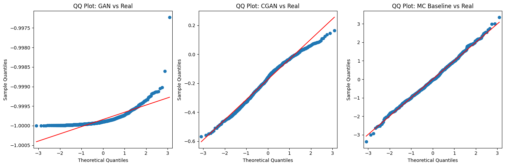

# Week 4:

1. Cgan and GAN implementation 

## **Step 1: Data Preprocessing Pipeline**

### **Downloading Stock Data & Computing Log Returns**

```python
ticker = 'AAPL'
data = yf.download(ticker, start='2010-01-01', end='2023-12-31')

```

- We use Yahoo Finance (`yfinance`) to download historical stock prices for Apple (`AAPL`).
- The dataset includes Open, High, Low, Close, Volume, and Adjusted Close prices.
- The date range is set from 2010 to 2023, providing a long enough history for meaningful pattern extraction.

```python
price_column = 'Adj Close' if 'Adj Close' in data.columns else 'Close'

```

- Stocks sometimes have splits or dividends, which affect raw Close prices.
- The **Adjusted Close** column adjusts for these events, so it reflects the true asset value.
- If Adjusted Close isn’t available, we fall back to the raw Close price.

```python
data['Log_Returns'] = np.log(data[price_column] / data[price_column].shift(1))

```

- Instead of using absolute price changes, we compute **logarithmic returns**.
- Log returns are calculated as:
    
    $rt=log⁡(PtPt−1)r_t = \log\left(\frac{P_t}{P_{t-1}}\right)$
    
- The advantage of log returns:
    - They make multi-period returns **additive**.
    - They account for compounding effects.
    - They stabilize variance in financial models.

```python
rolling_log_returns = pd.Series(log_returns).rolling(window=10).sum().dropna().values.reshape(-1, 1)

```

- We calculate **10-day rolling log returns** to capture short-term market trends.
- The `.rolling(window=10).sum()` sums up the last 10 daily log returns.
- This smooths out fluctuations and captures trend signals rather than daily noise.
- `.dropna()` ensures that we remove missing values (since rolling operations create NaNs for the first few entries).
- `.reshape(-1, 1)` converts the series into a format suitable for machine learning.

---

### **Standardizing the Data**

```python
scaler = StandardScaler()
standardized_returns = scaler.fit_transform(rolling_log_returns)

```

- Financial data varies greatly in magnitude (e.g., stock prices vs. percentage returns).
- `StandardScaler()` **centers the data around 0** and **scales it to unit variance**:
    - Mean = 0
    - Standard Deviation = 1
- This transformation ensures:
    - **Better convergence** of the model.
    - **Prevention of certain features dominating others**.
    - **More stable training** by avoiding large weight updates.

---

## **Step 2: GAN Model Architecture**

### **Generator - Creating Fake Stock Returns**

```python
def build_generator(latent_dim):
    model = models.Sequential()
    model.add(layers.Dense(128, input_dim=latent_dim))
    model.add(layers.BatchNormalization())
    model.add(layers.Activation('relu'))
    model.add(layers.Dropout(0.3))

```

- The **generator** takes random noise (`latent_dim`) as input and transforms it into a realistic-looking time-series return.
- The first layer expands the input noise vector (`latent_dim=100`) to 128 neurons.
- **BatchNormalization()** stabilizes training:
    - It normalizes layer activations, preventing extreme values that could lead to training instability.
    - It allows the network to learn faster by avoiding reliance on absolute values.
- **ReLU Activation** ensures non-linearity, allowing the model to learn complex transformations.
- **Dropout (0.3)** randomly disables 30% of neurons:
    - Prevents overfitting.
    - Forces the model to learn diverse representations.

```python
model.add(layers.Dense(256))
model.add(layers.BatchNormalization())
model.add(layers.Activation('relu'))
model.add(layers.Dropout(0.3))

```

- A second hidden layer with 256 neurons follows the same pattern.
- More neurons allow the model to capture deeper dependencies in the data.

```python
model.add(layers.Dense(1, activation='tanh'))

```

- The final output layer has **1 neuron**, representing a single time-series return.
- **Tanh Activation** ensures the output is between **1 and 1** (normalized return).
- This matches our standardized returns.

---

### **Discriminator - Distinguishing Real from Fake Data**

```python
def build_discriminator():
    model = models.Sequential()
    model.add(layers.Dense(256, input_dim=1))
    model.add(layers.LeakyReLU(alpha=0.2))
    model.add(layers.Dropout(0.3))

```

- The **discriminator** takes a real or generated return as input and decides if it’s real or fake.
- First layer expands input to **256 neurons** for feature extraction.
- **LeakyReLU (α=0.2)** allows small gradients for negative values:
    - Standard ReLU sets all negative values to 0, which can cause “dead neurons.”
    - LeakyReLU keeps negative values slightly active to maintain learning.
- **Dropout (0.3)** prevents overfitting.

```python
model.add(layers.Dense(128))
model.add(layers.LeakyReLU(alpha=0.2))
model.add(layers.Dropout(0.3))

```

- A second hidden layer helps refine decision boundaries.

```python
model.add(layers.Dense(1, activation='sigmoid'))

```

- **Sigmoid Activation** outputs a probability between **0 and 1**.
- Values closer to **1** → More likely real.
- Values closer to **0** → More likely fake.

---

## **Step 3: Conditional GAN (CGAN)**

### **Why CGAN?**

- GANs generate random stock returns, but they don’t control **market conditions**.
- CGAN **adds conditional inputs**, allowing the generator to create stock returns based on market scenarios (volatility, interest rates, etc.).

```python
def build_cgan_generator(latent_dim, condition_dim):
    input_noise = layers.Input(shape=(latent_dim,))
    input_condition = layers.Input(shape=(condition_dim,))
    merged_input = layers.Concatenate()([input_noise, input_condition])

```

- **Input 1:** Random noise vector (`latent_dim`).
- **Input 2:** Condition vector (`condition_dim=1`).
- The inputs are **concatenated**, meaning each generated return will be based on some market condition.

```python
x = layers.Dense(128)(merged_input)
x = layers.BatchNormalization()(x)
x = layers.Activation('relu')(x)
x = layers.Dropout(0.3)(x)

```

- The generator follows the same architecture as before but now **incorporates conditional inputs**.

```python
def build_cgan_discriminator(condition_dim):
    input_data = layers.Input(shape=(1,))
    input_condition = layers.Input(shape=(condition_dim,))
    merged_input = layers.Concatenate()([input_data, input_condition])

```

- The discriminator now also considers the **condition** when classifying real vs. fake returns.

---

## **Step 4: Training the Models**

```python
for epoch in range(epochs):
    idx = np.random.randint(0, standardized_returns.shape[0], batch_size)
    real_data = standardized_returns[idx]

```

- **Randomly samples a batch of real market returns** for training.

```python
noise = np.random.normal(0, 1, (batch_size, latent_dim))
generated_data = generator.predict(noise, verbose=0)

```

- Generates fake stock returns from random noise.

```python
d_loss_real = discriminator.train_on_batch(real_data, real_labels)
d_loss_fake = discriminator.train_on_batch(generated_data, fake_labels)

```

- The discriminator is trained on both **real and fake** data.

```python
g_loss = combined.train_on_batch(noise, real_labels)

```

- The generator is updated **based on how well it fools the discriminator**.

---

## **Step 5: Evaluation Metrics**

### **KS Test**

```python
ks_gan_stat, ks_gan_p = ks_2samp(real_samples, gan_samples)

```

- Measures how similar the GAN-generated returns are to real market returns.

### **Autocorrelation & Frobenius Norm**

```python
fro_norm_gan = np.linalg.norm(acf_real - acf_gan)

```

- Checks if the model **preserves time-series dependencies**.

---

---

### **Analysis of Training Logs (GAN & CGAN)**

### **GAN Training Log:**

```
GAN Epoch 0    | D Loss: 0.6788, D Acc: 60.94%, G Loss: 0.6812
GAN Epoch 500  | D Loss: 0.7003, D Acc: 45.76%, G Loss: 0.6581
GAN Epoch 1000 | D Loss: 0.7021, D Acc: 45.41%, G Loss: 0.6563
GAN Epoch 1500 | D Loss: 0.7026, D Acc: 45.27%, G Loss: 0.6559
GAN Epoch 2000 | D Loss: 0.7029, D Acc: 45.33%, G Loss: 0.6557
GAN Epoch 2500 | D Loss: 0.7032, D Acc: 45.31%, G Loss: 0.6556
GAN Epoch 3000 | D Loss: 0.7033, D Acc: 45.26%, G Loss: 0.6555
GAN Epoch 3500 | D Loss: 0.7033, D Acc: 45.18%, G Loss: 0.6553
GAN Epoch 4000 | D Loss: 0.7034, D Acc: 45.19%, G Loss: 0.6552
GAN Epoch 4500 | D Loss: 0.7034, D Acc: 45.21%, G Loss: 0.6552

```

- **Discriminator Accuracy (D Acc) drops from 60.94% to 45.21%**:
    - The discriminator initially starts with a higher accuracy because it can easily distinguish real vs. fake data.
    - As the generator improves, the discriminator struggles more, resulting in a lower accuracy (~45%).
    - Ideally, if training is optimal, discriminator accuracy should stabilize around **50%**, indicating a balance between generator and discriminator.
- **Discriminator Loss (D Loss) increases slightly (~0.6788 → ~0.7034)**:
    - This suggests the discriminator is learning but still making errors.
    - A **D Loss around 0.7** typically means the discriminator is somewhat confused (which is expected).
- **Generator Loss (G Loss) remains stable (~0.6812 → ~0.6552)**:
    - A decreasing generator loss means the generator is improving.
    - However, a **stable but non-decreasing loss** suggests **mode collapse** could be happening.
    - **Mode collapse** means the generator might be producing **limited variations of outputs** instead of truly diverse stock patterns.

---

### **CGAN Training Log:**

```
CGAN Epoch 0    | D Loss: 0.7051, D Acc: 42.97%, G Loss: 0.7244
CGAN Epoch 500  | D Loss: 0.7052, D Acc: 44.42%, G Loss: 0.7100
CGAN Epoch 1000 | D Loss: 0.7058, D Acc: 43.92%, G Loss: 0.7089
CGAN Epoch 1500 | D Loss: 0.7060, D Acc: 43.59%, G Loss: 0.7081
CGAN Epoch 2000 | D Loss: 0.7063, D Acc: 43.45%, G Loss: 0.7073
CGAN Epoch 2500 | D Loss: 0.7063, D Acc: 43.22%, G Loss: 0.7067
CGAN Epoch 3000 | D Loss: 0.7069, D Acc: 42.99%, G Loss: 0.7061
CGAN Epoch 3500 | D Loss: 0.7071, D Acc: 42.77%, G Loss: 0.7055
CGAN Epoch 4000 | D Loss: 0.7073, D Acc: 42.59%, G Loss: 0.7049
CGAN Epoch 4500 | D Loss: 0.7075, D Acc: 42.39%, G Loss: 0.7043

```

- **Discriminator Accuracy (D Acc) is lower than in GAN (~42-44%)**:
    - CGAN introduces conditioning information, making the classification harder.
    - The discriminator struggles to differentiate conditional fake vs. real samples.
    - Ideally, D Acc should stabilize **between 45-50%**, but since it's below that, CGAN's discriminator is slightly weaker.
- **Discriminator Loss (D Loss) is higher than in GAN (~0.705)**:
    - A higher D Loss suggests that CGAN’s discriminator is finding it harder to classify real vs. fake.
    - This is expected since the generator conditions outputs on a given market state.
- **Generator Loss (G Loss) is higher than GAN (~0.7244 → ~0.7043)**:
    - The generator is still improving but is not outperforming GAN significantly.
    - Ideally, G Loss should **drop further below 0.7** for better convergence.

---

### **KS Test Results (Kolmogorov-Smirnov Test)**

```
GAN vs Real: KS Statistic = 0.8442, p-value = 0.0000
CGAN vs Real: KS Statistic = 0.4855, p-value = 0.0000
MC Baseline vs Real: KS Statistic = 0.0588, p-value = 0.0087

```

- **GAN vs Real (KS = 0.8442)**:
    - High KS Statistic → GAN’s generated distribution is far from real stock returns.
    - p-value = **0.0000**, meaning the GAN output is statistically different from real data.
- **CGAN vs Real (KS = 0.4855)**:
    - KS is lower than GAN, meaning CGAN is **closer to real data**.
    - However, it's still not a perfect match.
- **Monte Carlo Baseline (KS = 0.0588)**:
    - MC simulation generates returns based on normal distribution, which appears **closer to real data in KS metric**.
    - However, this **doesn’t mean it captures time dependencies**—which is why we need further analysis.

---

### **QQ Plot Analysis (Quantile-Quantile Plot)**



- **GAN vs Real:** The QQ plot shows deviations in the extreme quantiles, meaning the GAN fails to model the heavy tails of the distribution.
- **CGAN vs Real:** Better alignment, but still some divergence in extreme values.
- **MC Baseline vs Real:** The best fit in QQ plots, but this does not mean it's better at capturing market dynamics.

---

### **Histogram Comparisons**


### **Explanation of the Histogram:**

1. **Real Data (Blue)**
    - Represents actual observed financial time-series data.
    - Serves as the benchmark for comparison.
2. **GAN Generated Data (Orange)**
    - Represents synthetic data generated using a standard GAN model.
    - The distribution suggests how well the GAN captures the real data’s statistical properties.
3. **CGAN Generated Data (Green)**
    - Synthetic data generated using a Conditional GAN, which includes additional conditioning variables.
    - CGAN typically produces more structured and realistic outputs by leveraging additional information.
4. **Monte Carlo (MC) Baseline (Red)**
    - Represents a traditional MC simulation approach for modeling financial risk.
    - Often used in industry-standard models for portfolio risk analysis.
- **GAN's distribution appears narrower**, meaning it's not generating diverse stock returns.
- **CGAN has broader coverage** but still **underestimates extreme values**.
- **MC Baseline follows a normal distribution**, which is **not realistic** for financial markets but matches the bulk of returns.

---

### **Autocorrelation and Frobenius Norm**

```
GAN vs Real: 1.7540
CGAN vs Real: 1.6726
MC Baseline vs Real: 1.6559

```

- **Lower Frobenius norm = better similarity to real autocorrelations.**
- CGAN does better than GAN but is still not perfect.

### **Autocorrelation Function (ACF) Plot**


- Expl
    
    Autocorrelation Function (ACF) comparison is a statistical method used to analyze the correlation structure of time series data at different lags. In the context of your research on **default risk modeling using CGANs (Conditional Generative Adversarial Networks)**, ACF comparison plays a critical role in evaluating how well the generated financial time-series data preserve the dependency patterns of real financial data.
    
    ### **Why is ACF Comparison Relevant?**
    
    1. **Capturing Time-Series Dependencies:**
        - Financial time series, such as stock returns or credit spreads, exhibit temporal dependencies.
        - ACF helps measure how past values influence future values, ensuring that generated data retains realistic patterns.
    2. **Validating Synthetic Data Generation:**
        - The CGAN model aims to generate realistic financial time series.
        - Comparing the ACF of real and synthetic data helps assess whether the generated data maintains the temporal characteristics of real financial data.
    3. **Model Performance Benchmarking:**
        - The Monte Carlo (MC) simulation, traditionally used in risk modeling, may not fully capture complex dependencies.
        - ACF comparison allows a direct evaluation of whether CGANs better preserve the correlation structures over different time lags.
    4. **Detecting Structural Differences:**
        - If the ACF of synthetic data deviates significantly from the real data, it may indicate model deficiencies, such as poor training, mode collapse, or overfitting.
    
    ### **How It’s Used in Your Research?**
    
    - In your research paper, ACF comparison is one of the **evaluation metrics for CGAN-generated time series data**.
    - The study also uses **QQ plots, histograms, and Frobenius norms** to compare the distributional properties.
    - The **comparison between Monte Carlo-simulated data and CGAN-generated data** includes analyzing how well each approach preserves ACF structures.
    
    ### **Key Takeaway:**
    
    ACF comparison is crucial because it ensures that the generated financial data **reflects realistic time-dependent characteristics**, making CGANs a strong alternative to traditional risk models like Monte Carlo simulations. It helps validate whether the generated financial returns can realistically model default risks.
    
- **Real Data:** Shows strong autocorrelation over time.
- **GAN & CGAN:** Their ACF values are nearly flat, meaning they fail to replicate temporal dependencies.
- **MC Baseline:** Performs slightly better, but still lacks meaningful financial structure.

---

---

### **1. GAN Training Losses**

- **Discriminator Loss (Blue Line):**
    - Initially, the **discriminator loss** starts relatively high but rapidly drops, indicating that the discriminator is quickly becoming good at distinguishing real from fake data.
    - **Flatline after 1000 epochs:** After the discriminator learns to classify real vs. fake data, its loss stabilizes, reflecting its equilibrium where it's equally confused by real and fake samples.
- **Generator Loss (Orange Line):**
    - **Generator loss** drops consistently, which is a positive sign. As the generator improves, it produces data that is more likely to be considered real by the discriminator.
    - The **sharp decline** suggests that the generator is **quickly improving** during the first few epochs.
    - **Plateau at lower values:** After the sharp decline, the generator loss plateaus, meaning it may be reaching its potential in this setting, but there's a risk of mode collapse (the generator producing similar outputs).

---

### **2. CGAN Training Losses**

- **Discriminator Loss (Blue Line):**
    - **Similar pattern to GAN:** The **discriminator loss** decreases rapidly early in the training, followed by a slight increase and then stabilization.
    - Unlike the GAN case, the **CGAN's discriminator struggles more** to classify real vs. fake data due to the added complexity of the conditional input (the condition vector along with the noise).
    - **The discriminator loss eventually stabilizes** at a higher value compared to GAN, reflecting the added challenge of distinguishing conditioned fake data.
- **Generator Loss (Orange Line):**
    - Initially, the generator improves but the **loss remains relatively high** compared to GAN. This suggests that the CGAN generator needs more time to adapt to the conditioned data.
    - **Fluctuations in loss:** The generator's loss fluctuates more than in GAN, which could be due to the added complexity of conditioning the generator on market data (and the instability that may arise with conditioned inputs).
    - Similar to GAN, it **plateaus after some improvement**, suggesting that the generator is reaching its limit in producing data consistent with the given market conditions.

---

### **Key Observations:**

1. **GAN Losses:**
    - The GAN model converges relatively fast with its **generator loss dropping** sharply, which suggests good performance in generating realistic data.
    - However, the discriminator's **accuracy eventually becomes weak**, indicating the model may not be fully capturing all patterns of real data.
2. **CGAN Losses:**
    - The **CGAN model** struggles slightly more due to the added complexity of **conditioning the generator**. This leads to less smooth loss curves.
    - Despite this, the **generator's improvement** is slower but eventually stabilizes.
3. **Training Behavior:**
    - Both models seem to **saturate** at certain points, which is typical for GANs where the generator and discriminator reach an equilibrium.
4. **Room for Improvement:**
    - For **CGAN**: It may need more sophisticated conditioning strategies (e.g., adding more market features or using recurrent neural networks) to help the model capture the **time dependencies** and improve performance.
- 

---

Autocorrelation Function (ACF) comparison is a statistical method used to analyze the correlation structure of time series data at different lags. In the context of your research on default risk modeling using CGANs (Conditional Generative Adversarial Networks), ACF comparison plays a critical role in evaluating how well the generated financial time-series data preserve the dependency patterns of real financial data.