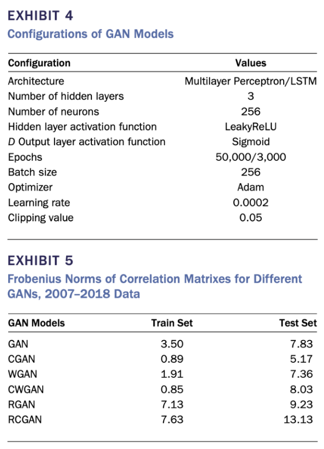

# Week 2: Exploration of Existing Risk Models

---

**Goal**: Research and compare traditional risk models like Monte Carlo simulations with advanced GAN-based models (CGANs, WGANs, RGANs, and RCGANs). Understand their applications in portfolio risk analysis.

Goal: Research existing risk models, including both traditional and deep learning-based methods. 

Tasks:- 

- Read the paper on Conditional GANs (CGANs) for default risk modeling and other references in the paper.
- Prepare a short report summarizing traditional risk models (e.g., Monte Carlo simulation)and advanced methods like GANs, WGANs, and RCGANs.
- Focus on how these models are used in portfolio risk analysis

---

## **Key Concepts**

### **1. Traditional Risk Models: Monte Carlo Simulation**

Monte Carlo simulations are widely used in finance to estimate portfolio risk metrics by repeatedly simulating outcomes based on predefined probability distributions.

### **How It Works**:

- **Inputs**: Historical data and assumptions about distribution (e.g., Gaussian or t-distribution).
- **Process**:
    1. Generate random scenarios for risk factors (e.g., returns, interest rates).
    2. Calculate portfolio outcomes for each scenario.
    3. Aggregate results to estimate metrics like Value at Risk (VaR) or Conditional VaR (CVaR).

### **Strengths**:

- Simple and widely accepted in the financial industry.
- Relatively easy to implement with minimal computational resources.
- Can use historical data for calibration.

### **Limitations**:

- **Rigid Assumptions**: Relies on predefined distributions, which may not reflect real-world patterns, especially for rare or extreme events.
- **Correlation Simplification**: Simplifies relationships between assets using models like CAPM, leading to inaccuracies.
- **Static Calibration**: Fails to adapt to sudden market changes, such as the COVID-19 crisis.

---

### **2. Advanced GAN-Based Models**

**Generative Adversarial Networks (GANs)** are machine learning models designed to generate synthetic data that mimics real financial data. They consist of:

- **Generator**: Creates synthetic data.
- **Discriminator**: Distinguishes between real and synthetic data.

### **How GANs Improve Risk Modeling**:

- GANs learn from data directly, avoiding explicit distributional assumptions.
- Useful for simulating high-dimensional financial time-series data, capturing complex relationships and market dynamics.

---

### **3. Variants of GANs in Financial Risk Analysis**

### **CGAN (Conditional GAN)**:

- **What It Adds**: Incorporates conditions (e.g., market volatility) into both the generator and discriminator.
- **Strengths**:
    - Tailored data generation for specific market scenarios (e.g., high or low volatility).
    - Better at capturing real-world patterns and correlations.
- **Applications**:
    - Used for scenario analysis and stress testing portfolios.

### **WGAN (Wasserstein GAN) and CWGAN**:

- **What It Adds**: Uses the Wasserstein loss function to improve training stability and mitigate mode collapse.
- **CWGAN**: Adds conditions like CGAN, enhancing performance.
- **Strengths**:
    - More stable training than traditional GANs.
    - Performs well in financial applications, though slightly less robust than CGAN.

### **RGAN (Recurrent GAN) and RCGAN**:

- **What It Adds**: Uses Recurrent Neural Networks (RNNs) or LSTMs to handle sequential (time-series) data.
- **RCGAN**: Adds conditions to RGAN for robustness.
- **Strengths**:
    - Captures long-term dependencies in time-series data.
    - Effective for modeling sequential financial data.
- **Limitations**:
    - Computationally expensive.
    - Can forget historical data due to limitations of RNN architectures.
    - Less effective than CGAN for extreme events.

---

## **Experimental Results (Exhibit 3)**

The following experiments compare different GAN-based models for financial time-series data:

1. **Dataset**:
    - Daily equity prices (Jan 3, 2007 – Dec 31, 2018).
    - **Portfolios**:
        - 42 BBB-rated issuers from the financial sector.
        - 390 issuers across industries and credit ratings.
    - **Returns**: 10-day rolling log returns used for stability.
2. **Tests**:
    - **Test 1**: Train on 11 years (2007–2018), test on 1 year.
    - **Test 2**: Extended dataset (1988–2018) for better generalization.
    - **Test 3**: Include COVID-19 period for stress testing.
3. **Observations**:
    - **CGAN**: Outperformed other models across all tests.
    - **CWGAN**: Performed slightly worse than CGAN.
    - **RGAN/RCGAN**: Improved with longer datasets but struggled with overfitting.
    - **GAN/WGAN**: Provided satisfactory results but lacked precision compared to CGAN.

---

## **Applications in Portfolio Risk Analysis**

GAN-based models can revolutionize portfolio risk analysis by:

- **Generating Synthetic Data**:
    - Simulate extreme events or rare scenarios for stress testing.
- **Correlation Modeling**:
    - Accurately capture relationships between assets, especially during volatile periods.
- **Scenario Analysis**:
    - Create specific market scenarios (e.g., high volatility) for evaluating portfolio performance.

---

## **Thought-Provoking Questions**

1. **Monte Carlo vs. GANs**:
    - Monte Carlo assumes distributions, while GANs learn directly from data. How might GANs outperform Monte Carlo for tail risk modeling?
2. **Data Requirements**:
    - GANs require large datasets for training. What challenges arise when financial data is limited, and how can these be addressed?
3. **Extreme Events**:
    - How can GANs generate realistic scenarios for rare events (e.g., financial crises) that are missing in historical data?
4. **Overfitting in GANs**:
    - GANs can overfit to training data, especially in time-series models like RGAN. What techniques can be used to prevent overfitting?
5. **Correlation and Realism**:
    - CGANs improve correlation representation. Why is this critical for portfolio risk analysis, and how does it impact real-world decision-making?

---